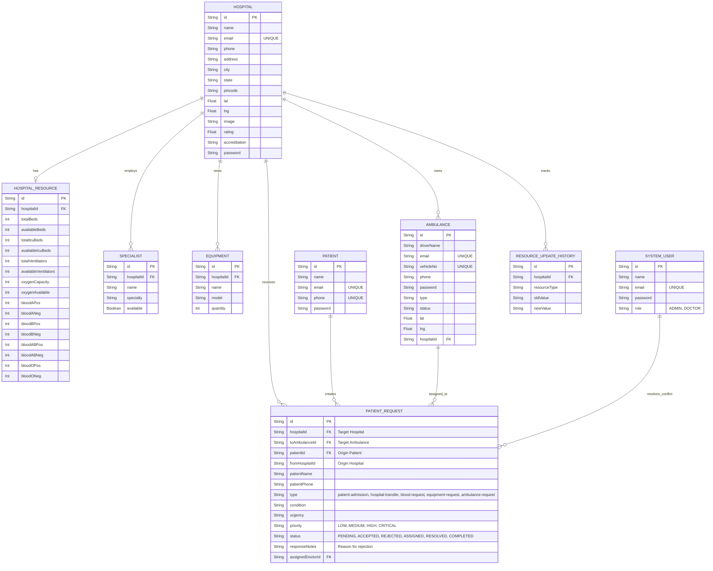

# MediLink ER Diagram

The following ER diagram represents the exact relationships between the main entities in the MediLink healthcare coordination platform v2.

```mermaid
erDiagram

HOSPITAL ||--o| HOSPITAL_RESOURCE : has
HOSPITAL ||--o{ SPECIALIST : employs
HOSPITAL ||--o{ EQUIPMENT : owns
HOSPITAL ||--o{ AMBULANCE : owns
HOSPITAL ||--o{ PATIENT_REQUEST : receives
PATIENT ||--o{ PATIENT_REQUEST : creates
AMBULANCE ||--o{ PATIENT_REQUEST : assigned_to
SYSTEM_USER ||--o{ PATIENT_REQUEST : resolves_conflict
HOSPITAL ||--o{ RESOURCE_UPDATE_HISTORY : tracks

HOSPITAL {
    String id PK
    String name
    String email "UNIQUE"
    String phone
    String address
    String city
    String state
    String pincode
    Float lat
    Float lng
    String image
    Float rating
    String accreditation
    String password
}

HOSPITAL_RESOURCE {
    String id PK
    String hospitalId FK
    Int totalBeds
    Int availableBeds
    Int totalIcuBeds
    Int availableIcuBeds
    Int totalVentilators
    Int availableVentilators
    Int oxygenCapacity
    Int oxygenAvailable
    Int bloodAPos
    Int bloodANeg
    Int bloodBPos
    Int bloodBNeg
    Int bloodABPos
    Int bloodABNeg
    Int bloodOPos
    Int bloodONeg
}

SPECIALIST {
    String id PK
    String hospitalId FK
    String name
    String specialty
    Boolean available
}

EQUIPMENT {
    String id PK
    String hospitalId FK
    String name
    String model
    Int quantity
}

PATIENT {
    String id PK
    String name
    String email "UNIQUE"
    String phone "UNIQUE"
    String password
}

AMBULANCE {
    String id PK
    String driverName
    String email "UNIQUE"
    String vehicleNo "UNIQUE"
    String phone
    String password
    String type
    String status
    Float lat
    Float lng
    String hospitalId FK
}

SYSTEM_USER {
    String id PK
    String name
    String email "UNIQUE"
    String password
    String role "ADMIN, DOCTOR"
}

PATIENT_REQUEST {
    String id PK
    String hospitalId FK "Target Hospital"
    String toAmbulanceId FK "Target Ambulance"
    String patientId FK "Origin Patient"
    String fromHospitalId "Origin Hospital"
    String patientName
    String patientPhone
    String type "patient-admission, hospital-transfer, blood-request, equipment-request, ambulance-request"
    String condition
    String urgency
    String priority "LOW, MEDIUM, HIGH, CRITICAL"
    String status "PENDING, ACCEPTED, REJECTED, ASSIGNED, RESOLVED, COMPLETED"
    String responseNotes "Reason for rejection"
    String assignedDoctorId FK
}

RESOURCE_UPDATE_HISTORY {
    String id PK
    String hospitalId FK
    String resourceType
    String oldValue
    String newValue
}
```
